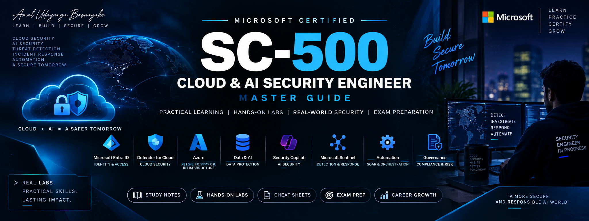
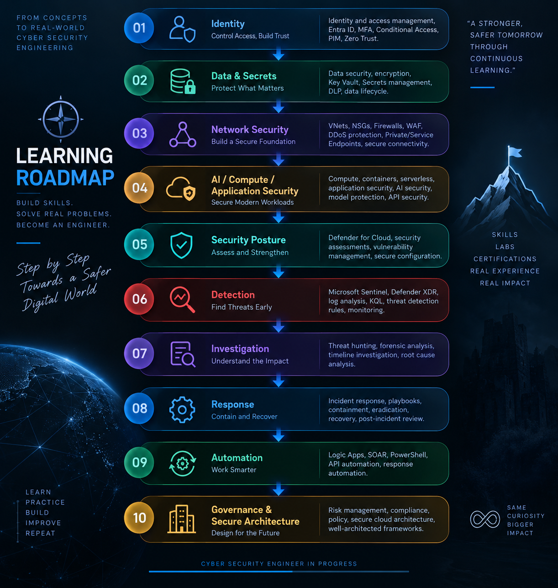
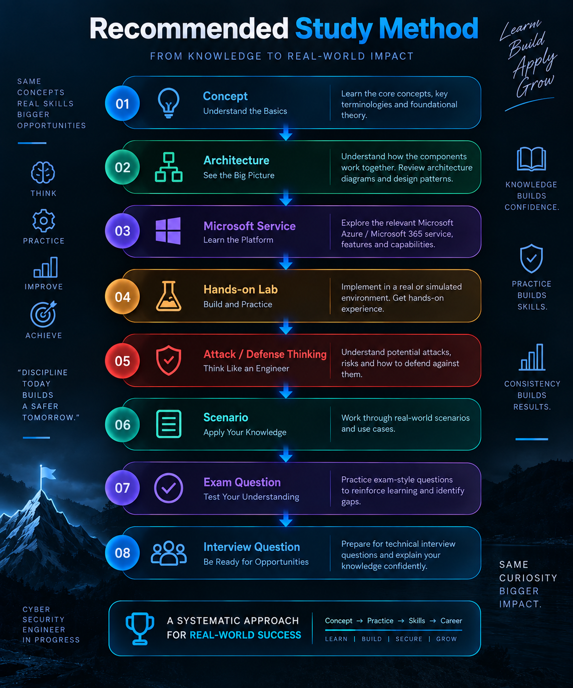

<p align="center">
  
</p>

<h1 align="center">🛡️ SC-500 Cloud & AI Security Engineer — Master Guide</h1>

<p align="center">
  <strong>A practical, continuously updated learning and hands-on engineering guide for Microsoft Certified: Cloud and AI Security Engineer Associate (SC-500).</strong>
</p>

<p align="center">
  
  
  
  
  
  
</p>

<p align="center">
  <a href="#-purpose">Purpose</a> •
  <a href="#-learning-roadmap">Roadmap</a> •
  <a href="#-hands-on-labs">Labs</a> •
  <a href="#-study-notes">Study Notes</a> •
  <a href="#-exam-preparation">Exam Prep</a> •
  <a href="#-resources">Resources</a>
</p>

<p align="center">
  <a href="./study-notes/SC-500_Complete_Study_Notes.pdf">
    📥 <strong>Download Complete Study Notes PDF</strong>
  </a>
</p>

---

## 🎯 Purpose

This guide is designed to connect **SC-500 exam knowledge with real-world Cloud & AI Security Engineering**.

Rather than treating security topics as isolated subjects, the guide connects:

| Security Area | Engineering Focus |
|---|---|
| 🔐 Identity & Access | Microsoft Entra ID, PIM, Conditional Access, authentication |
| 🔑 Data & Secrets | Azure Key Vault, storage, databases, data protection |
| 🌐 Network Security | Private Endpoints, Private Link, Azure Firewall, WAF, DDoS |
| 🤖 AI Security | Azure AI, Microsoft 365 Copilot, AI protection and governance |
| ☁️ Cloud Security | Microsoft Defender for Cloud and security posture |
| 🔎 Detection & Response | Microsoft Sentinel, Defender XDR, investigation |
| ⚙️ Automation | SOAR, Logic Apps, automated response workflows |
| 🧠 Security Copilot | AI-assisted security investigation and operations |
| 🏛️ Governance & Architecture | Policy, RBAC, compliance, secure architecture |

> **Cloud + AI = A Safer Tomorrow**  
> *Learn. Build. Secure. Respond. Automate.*

---

## 🧭 Learning Roadmap

The guide follows a practical engineering progression

<p align="center">
  
</p>


### 01 — Identity, Access & Governance

- Microsoft Entra ID
- Privileged Identity Management (PIM)
- Conditional Access
- MFA & passwordless authentication
- Authentication strengths
- Application identities
- App registrations vs Enterprise Applications
- OAuth permissions & consent
- Managed identities
- Azure Key Vault
- Azure Policy
- Azure RBAC
- Resource locks
- Backup security
- Infrastructure as Code security

### 02 — Data, Storage & Network Security

- Azure Storage security
- Azure SQL security
- Network security architecture
- Azure Virtual Network Manager
- Virtual WAN
- VPN
- Microsoft Entra Private Access
- Private Link
- Private Endpoints
- Service Endpoints
- Azure Firewall
- Network Watcher
- DDoS Protection
- Web Application Firewall

### 03 — AI, Compute & Application Security

- Microsoft Copilot security
- Microsoft Purview DSPM for AI
- Overshared data protection
- Sensitivity Labels
- Data Loss Prevention
- Copilot Studio protection
- Entra Agent ID
- AI Gateway / API Management
- Defender for AI Services
- AI workload security
- Virtual machine security
- Container security
- Azure Functions
- Logic Apps
- App Service
- Web Application Firewall

### 04 — Security Posture, Detection & Response

- Microsoft Defender for Cloud
- Cloud Security Posture Management
- Multicloud security
- External Attack Surface Management
- Microsoft Defender Vulnerability Management
- Microsoft Sentinel
- Data connectors
- Log Analytics
- Analytics rules
- Automation rules
- Playbooks
- Microsoft Defender XDR
- Microsoft Purview Audit
- Security Copilot

---

## 🧪 Hands-on Labs

Every lab follows an engineering workflow:

<p align="center">
  
</p>


### 🤖 AI Security Lab Portfolio

| # | Lab | Primary Focus |
|---|---|---|
| 01 | [Azure OpenAI Private Endpoint Zero Trust Lab](https://github.com/AmalUBasnayake/Azure-OpenAI-Private-Endpoint-Zero-Trust-Lab) | Azure OpenAI, Private Endpoint, Key Vault, Managed Identity, RBAC, Private DNS, Zero Trust |
| 02 | [Azure Content Safety — Prompt Guard](https://github.com/AmalUBasnayake/azure-content-safety-prompt-guard) | Azure Content Safety / prompt protection |
| 03 | [Microsoft Purview — AI Shield DLP Lab](https://github.com/AmalUBasnayake/purview-ai-shield-dlp-lab) | Sensitivity Labels, DLP, Microsoft 365 Copilot data protection |
| 04 | [AI Threat Detection & Response — Microsoft Sentinel](https://github.com/AmalUBasnayake/SC-500-Lab-04-AI-Threat-Detection-Response-Microsoft-Sentinel) | AI threat detection and response |
| 05 | [AI Security Posture & Threat Protection — Defender for Cloud](https://github.com/AmalUBasnayake/SC-500-Lab-05-AI-Security-Posture-Threat-Protection-Microsoft-Defender-for-Cloud) | AI security posture and threat protection |
| 06 | [AI Runtime Threat Protection — Defender for Cloud](https://github.com/AmalUBasnayake/SC-500-Lab-06-AI-Runtime-Threat-Protection-Microsoft-Defender-for-Cloud) | Runtime threat protection |
| 07 | [AI Security Investigation & Response — Defender XDR](https://github.com/AmalUBasnayake/SC-500-Lab-07-AI-Security-Investigation-Response-Microsoft-Defender-XDR) | AI security investigation and response |

### 🔐 Lab Engineering Principles

Each practical lab should answer:

1. What are we protecting?
2. Who or what is requesting access?
3. What security boundary exists?
4. Which control prevents the attack?
5. What telemetry proves the control worked?
6. How would we detect suspicious activity?
7. How would we investigate it?
8. What response action should occur?
9. What can be automated?
10. What evidence should be documented?

---

## 📚 Study Notes

The companion study notes are structured as a complete SC-500 learning resource covering:

- Exam orientation and study strategy
- Skill domains and topic mapping
- Identity & access security
- Data and secrets protection
- Network security
- AI security
- Compute and application security
- Defender for Cloud
- Microsoft Sentinel
- Defender XDR
- Security Copilot
- Scenario-based decision making
- Least-privilege role selection
- Common exam traps
- Final revision strategy
- Verification and lab resources

### 📥 Download Complete Study Notes

<p align="center">
  <a href="./study-notes/SC-500_Complete_Study_Notes.pdf">
    
  </a>
</p>

> 📌 **The PDF is the primary downloadable study reference. An editable DOCX version is also maintained in the same folder.**

### 📖 Recommended Study Method

<p align="center">
  
</p>

---

## 🧠 Engineering Mindset

The objective is not only to memorize Microsoft services.

The objective is to understand **why a security control is selected, where it is deployed, what threat it addresses, what telemetry it generates, and how the organization responds when something goes wrong.**

### Security Decision Principles

- Least privilege
- Zero Trust
- Defense in depth
- Identity-first security
- Secure-by-design architecture
- Continuous monitoring
- Evidence-driven investigation
- Automated response where appropriate
- Governance aligned with technical controls

---

## 🔎 Investigation & Response Framework

Use this framework when analyzing a security scenario:

```text
1. Identify the workload
        ↓
2. Identify the identity
        ↓
3. Identify the resource / data
        ↓
4. Determine expected behavior
        ↓
5. Collect telemetry
        ↓
6. Detect suspicious activity
        ↓
7. Investigate the incident
        ↓
8. Contain the threat
        ↓
9. Remediate the root cause
        ↓
10. Automate and improve
```

---

## ⚙️ Detection & Automation

Key technologies used throughout the guide include:

- Microsoft Sentinel
- KQL
- Analytics Rules
- Automation Rules
- Logic Apps
- Playbooks
- Microsoft Defender XDR
- Microsoft Defender for Cloud
- Microsoft Security Copilot

The goal is to progress from:

**Alert → Detection → Investigation → Response → Automation**

---

## 📝 Exam Preparation

The exam preparation section focuses on:

- Scenario-based questions
- Microsoft service selection
- Least-privilege decisions
- Security architecture decisions
- Identity and access scenarios
- Network security scenarios
- AI security scenarios
- Detection and response scenarios
- Numbers, defaults and configuration details
- Common exam traps
- Final revision

### Exam Thinking Pattern

Before selecting an answer, ask:

```text
What is the requirement?
        ↓
What is the security objective?
        ↓
Which Microsoft service provides that capability?
        ↓
Which configuration satisfies the requirement?
        ↓
What is the least-privilege / most appropriate option?
```

---

## 📊 Progress Tracker

| Area | Status |
|---|---|
| SC-500 Study Notes | 🟢 PDF Available |
| Identity & Access | 🟢 |
| Data & Secrets | 🟢 |
| Network Security | 🟢 |
| AI Security | 🟢 |
| AI Security Labs | 🟢 7 Hands-on Labs |
| Detection & Response | 🟢 |
| Microsoft Sentinel | 🟢 |
| Defender for Cloud | 🟢 |
| Defender XDR | 🟢 |
| Security Copilot | 🟢 |
| Cheat Sheets | 🟡 Expanding |
| Exam Preparation | 🟡 Expanding |
| Master Guide | 🟡 In Progress |

---

## 📁 Repository Structure

```text
SC-500-Cloud-AI-Security-Engineer-Master-Guide/
│
├── assets/
│   └── sc500-master-guide-banner.png
│
├── study-notes/
│   ├── SC-500_Complete_Study_Notes.pdf
│   ├── SC-500_Complete_Study_Notes_EN.docx
│   └── README.md
│
├── labs/
│   ├── AI Security
│   ├── Identity & Access
│   ├── Network Security
│   ├── Data Security
│   ├── Detection & Response
│   └── Automation
│
├── cheat-sheets/
│
├── exam-preparation/
│
├── resources/
│
└── README.md
```

---

## 🌐 Resources

- [Microsoft Learn — SC-500](https://learn.microsoft.com/)
- [Microsoft Security](https://www.microsoft.com/security)
- [Microsoft Azure](https://azure.microsoft.com/)
- [Microsoft Sentinel](https://azure.microsoft.com/products/microsoft-sentinel)
- [Microsoft Defender for Cloud](https://azure.microsoft.com/products/defender-for-cloud)
- [Microsoft Defender XDR](https://www.microsoft.com/security/business/siem-and-xdr/microsoft-defender-xdr)
- [Microsoft Purview](https://www.microsoft.com/purview)

---

## 👨‍💻 Author

**Amal Udayanga Basnayake**

IT & Systems Specialist | Cybersecurity | Azure Security | SIEM & Threat Detection

- GitHub: [@AmalUBasnayake](https://github.com/AmalUBasnayake)
- LinkedIn: [Amal Udayanga Basnayake](https://www.linkedin.com/in/amal-udayanga-basnayake/)
- Portfolio: [amalcyberlab.vercel.app](https://amalcyberlab.vercel.app/)
- Medium: [@amalubasnayake](https://medium.com/@amalubasnayake)

---

## 🚀 About This Project

This is a **living project**.

The guide will continue to evolve with:

- New hands-on labs
- Updated Microsoft security capabilities
- AI security scenarios
- Detection and investigation techniques
- Architecture diagrams
- KQL examples
- Automation workflows
- Exam preparation material
- Practical engineering lessons

> **Learn → Build → Secure → Detect → Investigate → Respond → Automate**

---

## ⚠️ Disclaimer

This repository is an independent learning and engineering resource. It is not an official Microsoft certification guide and is not affiliated with or endorsed by Microsoft.

---

<p align="center">
  <strong>Cloud + AI = A Safer Tomorrow 🛡️</strong>
</p>

<p align="center">
  <sub>Learn. Build. Secure. Respond. Automate.</sub>
</p>
